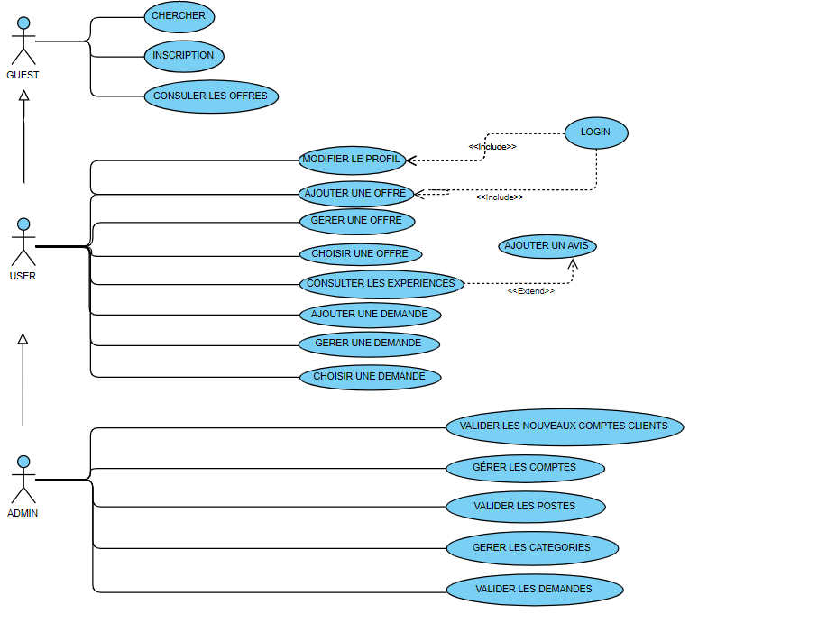

pour le projet angular il faut installer les dependence par la command:
npm i

Pour asp.net webApi il faut créer une nouvel base de donnéenommé:
Tourisme

coller dasn votre base donnée "Tourisme" script SQL qui se trouve dans le dossier "Tourisme asp.net webApi"
execute pour générer les tableau

et il faut créer une nouvel connexion nommé:
TourismeEntities
//////////////////////////////////////////////////////////////////////////////////////////////////////////////

# Cahier des charges:

## 1 - Contexte et définition du projet:

Le projet est une plateforme qui consiste à développer un site web qui facilite le voyage avec le minimum des charges.
Ce site est destiné à tous les touristes et les personnes intéressées par le voyage.

## 2 - Objectif du projet:

L’objectif est de minimiser les charges de voyage principalement au niveau du logement, et faire l’échange des cultures externes entre les clients faisant une nouvelle innovation dans le domaine touristique.

## 3 - Périmètre du projet:

Notre solution se limitera à la gestion de l’échange gratuit des logements et d’autres services entre les utilisateurs.

 ## 4 – Description fonctionnelle des besoins:
 
 
D’après notre expérience de voyage on a découvert que la majorité de budget est dépensée au niveau de logement, alors on a fait des recherches au niveau international et on a trouvé que le budget moyen des vacances au monde est de 2 277€ et se décompose ainsi :
-	35% pour le logement,
-	25% pour le vol,
-	13 % à la restauration,
-	10 % au shopping, 
-	9 % au transport sur place,
-	8 % aux activités.
Donc notre plateforme sert à minimiser 35% de logement et on peut ainsi diminuer leur budget de restauration.
Le voyageur aura la possibilité de chercher dans les publications disponibles sur notre plateforme les logements et les services qui correspond à ses besoins.

  ## 5 - Utilisation:

Admin général :
-Gérer les comptes des clients et valider tous les nouvelles postes
-Vérifier de nouveaux membres
-Confirmer ou refuser les nouveaux membres 
-Gérer la liste des clients (ajouter / modifier /supprimer /récupérer mot de passe).
Client buyer :
-Voir tous les offres
-Choisir les offres nécessaires
-Choisir la date d’arrivé
-Contacter le guesthouse
-Demander des Hangout
-Donner l’avis (feedback)
-Partager le local avec vos amis
-Messager des autres clients 
-Inviter des amis 
-Modifier le profile 
Client seller :
-Valider la date et accepter
-Poster (modifier et supprimer)
-Share with friends
-Donner des feedback
-Share your host
Guest:
See all the website and all offers 
Sign in /sign up

## 6 - Enveloppe budgétaire:

Partie conception :
Design UI/UX :
Partie front-end :
Partie back-end :
Host/nom de domaine :
Publicité :

## 7 - Délais de réalisation:

Les délais sont estimés vers 10 jours.

## 8 - USE CASE: 

 
## 9 - Diagramme de class :

