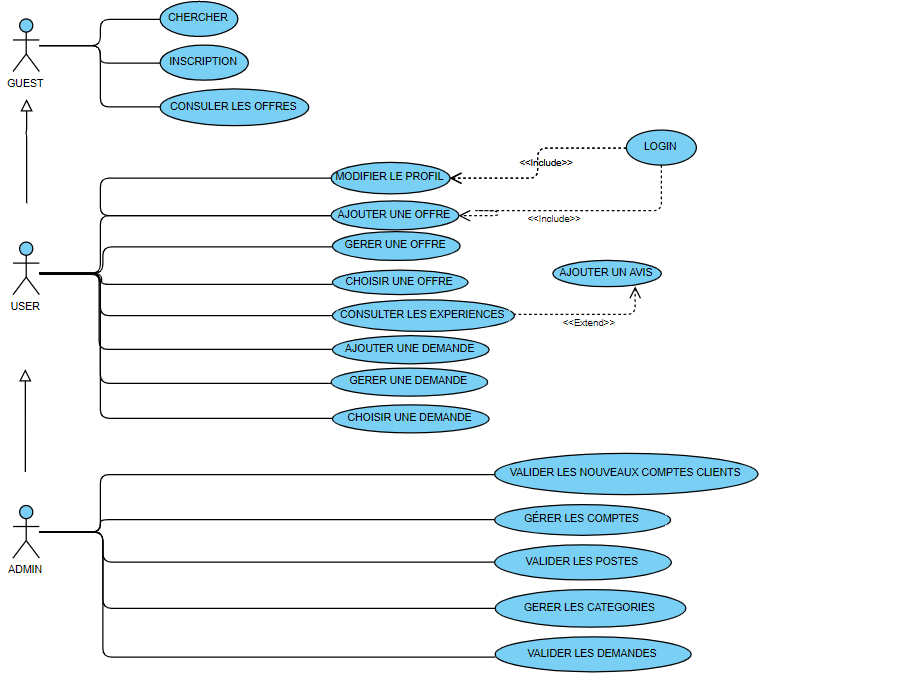
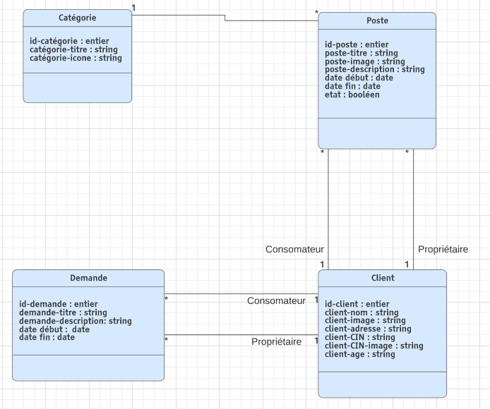
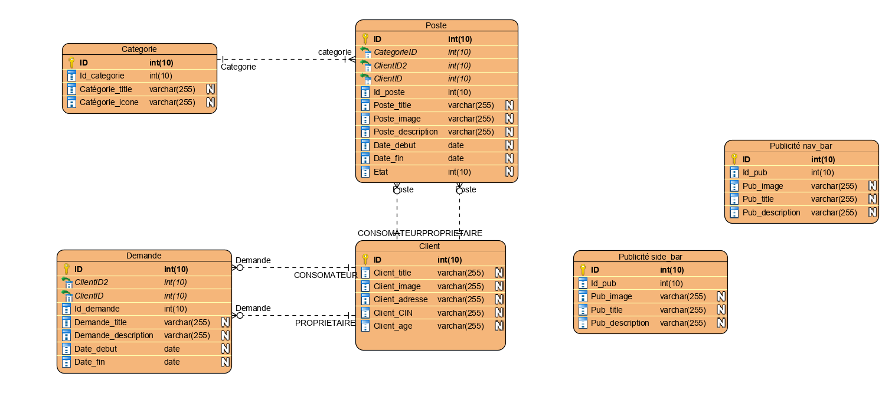
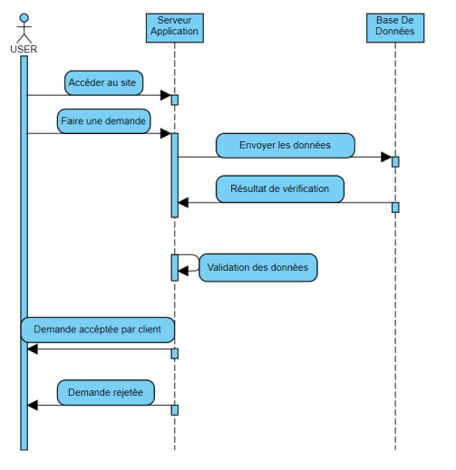
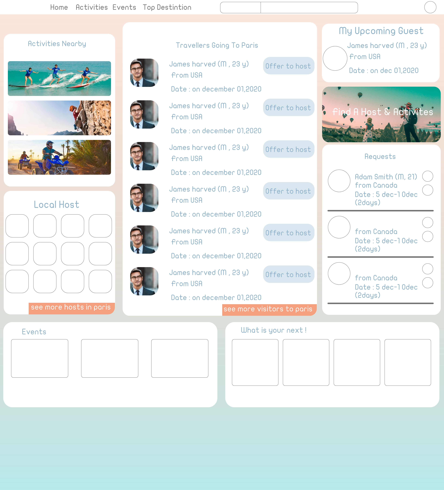
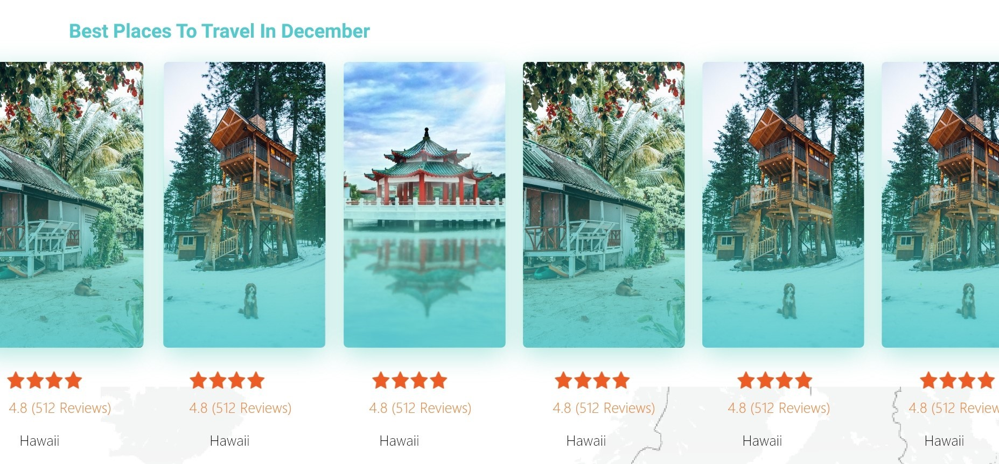
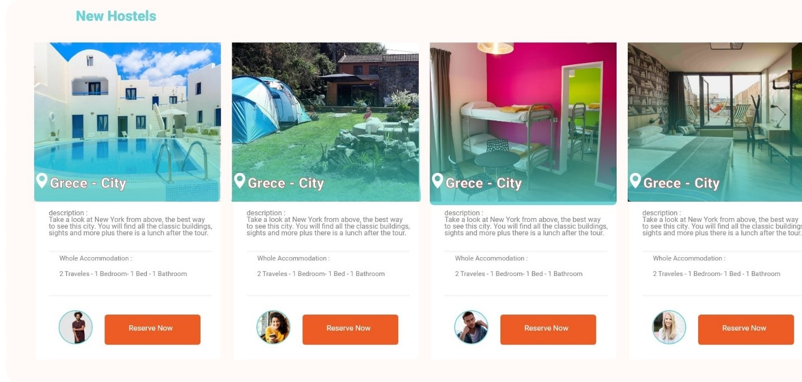
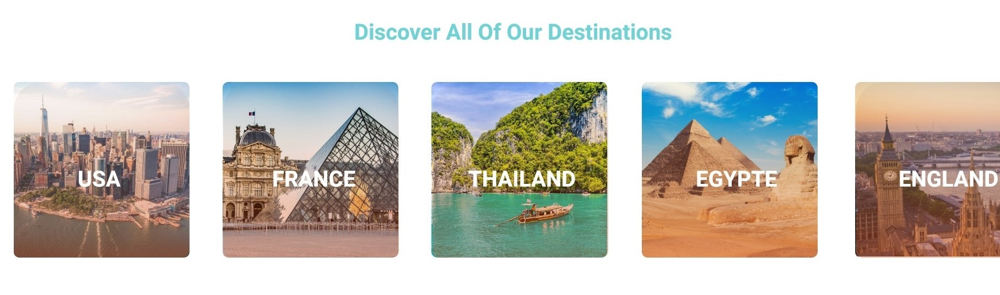
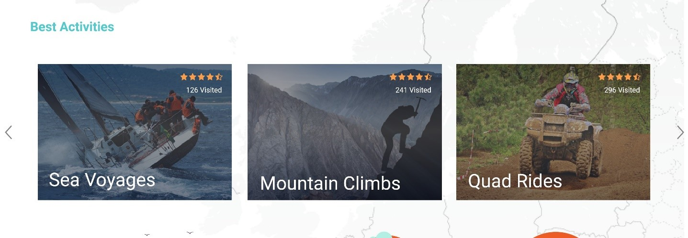

# Cahier des charges

## 1 - Contexte et définition du projet:

Le projet est une plateforme qui consiste à développer un site web qui facilite le voyage avec le minimum des charges.
Ce site est destiné à tous les touristes et les personnes intéressées par le voyage.

## 2 - Objectif du projet:

L’objectif est de minimiser les charges de voyage principalement au niveau du logement, et faire l’échange des cultures externes entre les clients faisant une nouvelle innovation dans le domaine touristique.

## 3 - Périmètre du projet:

Notre solution se limitera à la gestion de l’échange gratuit des logements et d’autres services entre les utilisateurs.

 ## 4 – Description fonctionnelle des besoins:
 
 
D’après notre expérience de voyage on a découvert que la majorité de budget est dépensée au niveau de logement, alors on a fait des recherches au niveau international et on a trouvé que le budget moyen des vacances au monde est de 2 277€ et se décompose ainsi :
-	35% pour le logement,
-	25% pour le vol,
-	13 % à la restauration,
-	10 % au shopping, 
-	9 % au transport sur place,
-	8 % aux activités.
Donc notre plateforme sert à minimiser 35% de logement et on peut ainsi diminuer leur budget de restauration.
Le voyageur aura la possibilité de chercher dans les publications disponibles sur notre plateforme les logements et les services qui correspond à ses besoins.

  ## 5 - Utilisation:

Admin général :
-Gérer les comptes des clients et valider tous les nouvelles postes
-Vérifier de nouveaux membres
-Confirmer ou refuser les nouveaux membres 
-Gérer la liste des clients (ajouter / modifier /supprimer /récupérer mot de passe).
Client buyer :
-Voir tous les offres
-Choisir les offres nécessaires
-Choisir la date d’arrivé
-Contacter le guesthouse
-Demander des Hangout
-Donner l’avis (feedback)
-Partager le local avec vos amis
-Messager des autres clients 
-Inviter des amis 
-Modifier le profile 
Client seller :
-Valider la date et accepter
-Poster (modifier et supprimer)
-Share with friends
-Donner des feedback
-Share your host
Guest:
See all the website and all offers 
Sign in /sign up

## 6 - Enveloppe budgétaire:

Partie conception :
Design UI/UX :
Partie front-end :
Partie back-end :
Host/nom de domaine :
Publicité :

## 7 - Délais de réalisation:

Les délais sont estimés vers 10 jours.

## 8 - USE CASE: 

 
## 9 - Diagramme de class :

mise ajour

## 10 - Diagramme de Séquence :

//////////////////////////////////////////////////////////////////////////////////////////////////////////////////////////////////////
# design graphic du projet

## accueil:
En cours de développement.

## tableau de bord
 
 En cours de développement.
 
 
 
 ////////////////////////////////////////////////////////////////////////////////////////////////////////////////////////////////////
 
 # Le projet tourisme partie ASP.NET
 
Projet ASP.NET utilisant identité et entité Framework.

## Les packages installés : 
•	Microsoft.AspNet.WebApi.Cors.
•	Microsoft.AspNet.Identity.Core
•	EntityFramework
•	Miscrosoft.Owin.Cors
## Conception de Code : 
•	Partie RESTAPI tourisme qui contient des contrôleurs et des models.
•	Partie DATA sous forme d’une bibliothèque de classe qui contient un ADO lié avec notre base de données 
•	Partie LOGIQUE qui contient des traitements hors métiers.
## Les API à consommer :

### AUTHENTIFICATION :

#### •	Pour consommer API de registrement il faut utiliser le lien :
#####  Api/sinscrire ainsi qu’envoyer les informations au body :

Name(String), 
LastName(String),
Email(String),
Password(String), 
ConfirmPassword(String).

#### •	Pour s’identifier il faut utiliser :
  ##### /token et envoyer au body :(Post)

##### -	"username=" + Le nom d’utilisateur + "& password d’utilisateur=" + password + "&grant_type=password” ;

#### •	Et envoyer au header une autorisation (Post)
##### -	var reqHeader = new HttpHeaders({ 'Content-Type': 'application/x-www-urlencoded', 'No-Auth': 'True' }); { headers: reqHeader }
### HOME:

#### •	Pour avoir les postes par option ou par ordre il faut utiliser le lien (get) : 

##### api/choioptionLimits/{prend}/{option}.

#### •	Et pour option vous avez 3 types : Best et Date, et si vous n’avez pas mentionné votre option vous allez avoir les données aléatoirement.

•	Poste_image (string) 
•	noteAvis (double)
•	Poste_description (string)
•	Poste_title (string)
•	ID (int)
 
 

•	Poste_image (string) 
•	noteAvis (double)
•	Poste_description (string)
•	Poste_title (string)
•	ID(int)

•	les pays qui sont disponible sur les poste 
•	Poste_image (string) 
•	Pay(string)
•	ID(int)

#### •	Pour avoir les best activités il faut utiliser le lien (get) : 
##### api/lesMeilleursActivites.
•	Id(int)
•	Activite_titre(string)
•	Activite_image(string)
•	Activite_NombreAvis(int)
•	Activite_NoteAvis(double)

### DASHBOARD utilisateur:
#### touts les postes d’un utilisateur :
##### routeTemplate: "api/AllUserPostsInfo/{id}",
#### pour supprimer un post :
##### routeTemplate: api/DeletePost/{id}

 

